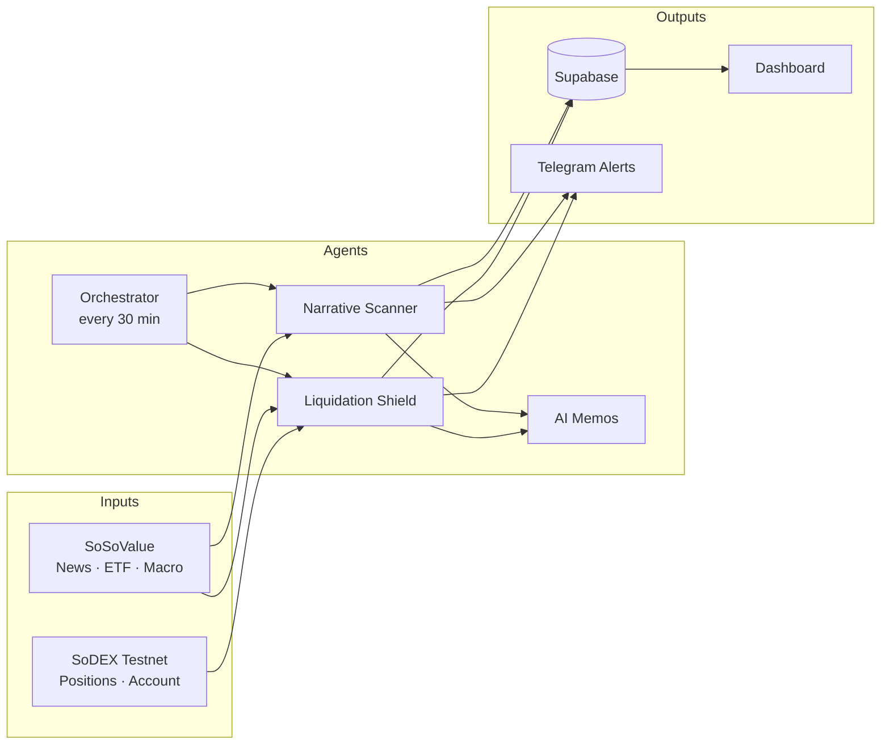

# Sentinel Finance

Crypto trading intelligence that finds narrative alpha and protects open positions.

Sentinel Finance connects **SoSoValue** market data with **SoDEX** testnet execution. Two agents run on a schedule, score sectors, monitor liquidation risk, write AI memos, and alert you on Telegram and the dashboard.

**Live demo:** [frontend-eight-gilt-90.vercel.app](https://frontend-eight-gilt-90.vercel.app)

---

## What It Does

| Agent | What it does |
|-------|--------------|
| **Narrative Alpha Scanner** | Scores 8 crypto sectors (DeFi, AI, RWA, L1, L2, GameFi, DePIN, Meme) using news, ETF flow, and macro events |
| **Liquidation Shield** | Monitors SoDEX positions for liquidation distance, leverage risk, and macro-event pressure |

**Dashboard** — terminal-style UI for signals, positions, alerts, memos, and SoDEX market data.

**Telegram** — alerts for strong signals and high-risk positions, plus bot commands for status and trades.

---

## Workflow



1. **Orchestrator** runs both agents on a 30-minute cycle.
2. **Narrative Scanner** pulls SoSoValue data, scores sectors, and flags top signals.
3. **Shield Agent** reads SoDEX positions, calculates risk, and triggers alerts above the threshold.
4. **AI** generates trade memos for signals and risk events.
5. Results are saved to **Supabase** and surfaced on the **dashboard** and **Telegram**.

---

## Quick Start

```bash
git clone https://github.com/Anu062004/Herewesoso.git
cd Herewesoso

npm install
npm --prefix frontend install

cp .env.example .env   # fill in API keys

npm run dev            # backend → http://localhost:3001
npm run frontend:dev   # frontend → http://localhost:3000
```

### Required Environment Variables

| Variable | Purpose |
|----------|---------|
| `SOSOVALUE_API_KEY` | SoSoValue market data |
| `AI_SERVICE` + provider key | AI memos (`grok`, `groq`, `gemini`, or `claude`) |
| `SUPABASE_URL` + `SUPABASE_SERVICE_ROLE_KEY` | Data persistence |
| `SODEX_ACCOUNT_ADDRESS` + `SODEX_API_PRIVATE_KEY` | Position reads and signed actions |
| `TELEGRAM_BOT_TOKEN` + `TELEGRAM_CHAT_ID` | Alerts (optional) |

See [`.env.example`](.env.example) for the full list.

### Database

Create these Supabase tables: `narrative_scores`, `position_risks`, `alerts`, `trade_memos`, `agent_runs`. Full SQL is in the [docs commit history](https://github.com/Anu062004/Herewesoso/commits/main) or run the schema from your build spec.

---

## API (Essentials)

| Endpoint | Description |
|----------|-------------|
| `GET /health` | Health check |
| `GET /api/signals` | Sector scores |
| `GET /api/positions` | Live positions + risk history |
| `GET /api/alerts` | Alert feed |
| `POST /api/trigger` | Run agent cycle manually |
| `POST /api/actions` | Close position / reduce leverage |

---

## Stack

Next.js 14 · Express · TypeScript · Supabase · SoSoValue API · SoDEX testnet · Telegram · Vercel

More detail: [API & EIP-712 notes](docs/api-and-eip712-integration-notes.md)
