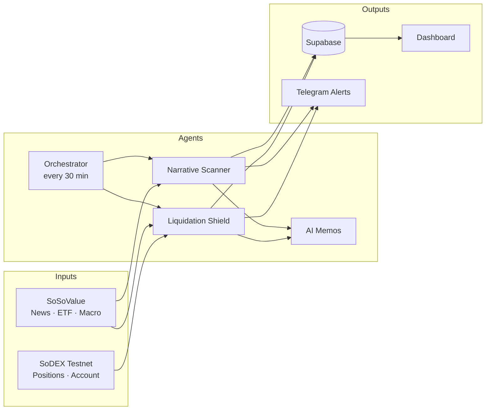
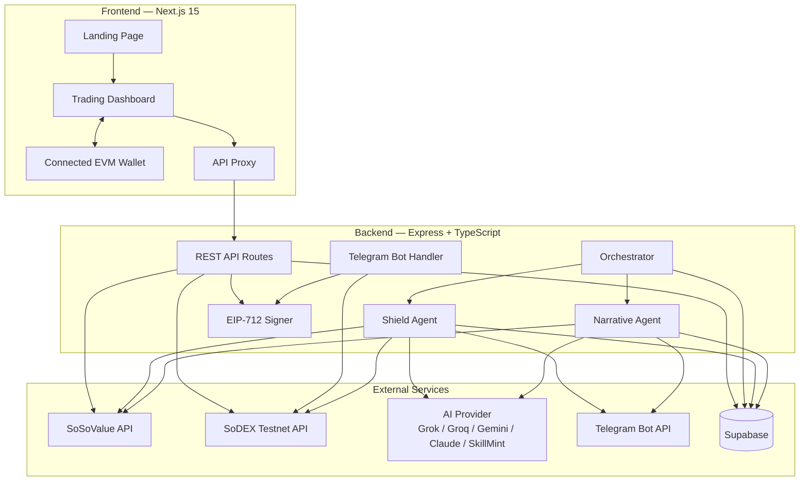

# Gold & Grith

**Market context in. Risk decisions out.**

Gold & Grith is a crypto trading intelligence terminal that connects [SoSoValue](https://sosovalue.com) market data with [SoDEX](https://sodex.com) perps execution on testnet. Two coordinated agents run on a configurable schedule, score crypto sectors, monitor open positions for liquidation risk, generate AI trade memos, and push operator alerts to Telegram and the dashboard.

**Live demo:** [frontend-eight-gilt-90.vercel.app](https://frontend-eight-gilt-90.vercel.app)

**Repository:** [github.com/Anu062004/Herewesoso](https://github.com/Anu062004/Herewesoso)

---

## Table of Contents

- [Product Overview](#product-overview)
- [The Problem](#the-problem)
- [How It Works](#how-it-works)
- [Architecture](#architecture)
- [Key Features](#key-features)
- [Tech Stack](#tech-stack)
- [Project Structure](#project-structure)
- [Prerequisites](#prerequisites)
- [Installation](#installation)
- [Environment Variables](#environment-variables)
- [Database Setup](#database-setup)
- [Running Locally](#running-locally)
- [API Reference](#api-reference)
- [Dashboard](#dashboard)
- [Agent Loops](#agent-loops)
- [AI Providers](#ai-providers)
- [Telegram Bot](#telegram-bot)
- [SoDEX Signing](#sodex-signing)
- [Deployment](#deployment)
- [Testing](#testing)
- [Roadmap](#roadmap)
- [Documentation](#documentation)
- [Security Notes](#security-notes)

---

## Product Overview

Gold & Grith is built for crypto operators who need **narrative alpha discovery** and **position protection** in one terminal-style workspace. The product follows an **Observe → Reason → Act** loop:

| Phase | What happens | Sources |
|-------|--------------|---------|
| **Observe** | Pull news, ETF flows, macro calendar, and live perp positions | SoSoValue API, SoDEX testnet |
| **Reason** | Score sectors, calculate liquidation risk, write AI memos | Narrative Scorer, Risk Calculator, LLM adapters |
| **Act** | Alert operators, surface signals on the dashboard, submit signed trades | Telegram, Supabase, EIP-712 SoDEX writes |

| Agent | Purpose | Primary Data Sources |
|-------|---------|----------------------|
| **Narrative Alpha Scanner** | Scores 8 crypto sectors and surfaces entry signals | SoSoValue news, ETF flow, macro calendar |
| **Liquidation Shield** | Monitors perps positions for liquidation distance and macro-event pressure | SoDEX testnet account/positions, SoSoValue macro data |

Both agents share a common orchestrator, persist results to Supabase, and notify operators via Telegram. The Next.js dashboard provides live polling views, confirmation-gated execution actions, and a trading-terminal UX.

---

## The Problem

Crypto traders juggle fragmented tools: one feed for news and narratives, another for macro calendars, another for positions and liquidation risk. By the time you connect "this sector is heating up" with "my BTC long is 5% from liquidation before CPI," the move has often already happened.

Gold & Grith closes that gap by turning market context into risk decisions on a single operating surface — from SoSoValue intelligence to SoDEX action.

---

## How It Works



1. The **orchestrator** runs both agents on a 30-minute cycle (configurable).
2. The **Narrative Scanner** pulls SoSoValue data, scores sectors, and flags top signals.
3. The **Shield Agent** reads SoDEX positions, calculates risk, and triggers alerts above the threshold.
4. **AI** generates trade memos for signals and risk events.
5. Results are saved to **Supabase** and surfaced on the **dashboard** and **Telegram**.

Default cycle interval: **30 minutes** (`CYCLE_INTERVAL_MS=1800000`).

---

## Architecture



### Component Responsibilities

| Layer | Responsibility |
|-------|----------------|
| **Orchestrator** | Schedules agent cycles, prevents overlap, logs runs, sends daily summaries |
| **Narrative Agent** | Fetches SoSoValue data, scores 8 sectors, generates memos and signal alerts |
| **Shield Agent** | Reads SoDEX positions, computes risk scores, escalates high-risk positions |
| **AI adapters** | Pluggable memo generation behind a single interface (`AI_SERVICE`) |
| **SoDEX signer** | Builds EIP-712 `ExchangeAction` payloads, manages per-address nonces, and verifies connected-wallet signatures |
| **Supabase** | Persistent store for scores, risks, alerts, memos, and agent run audit log |
| **Dashboard** | Terminal UI with polling, heatmaps, risk gauges, and confirmation-gated actions |
| **API proxy** | Next.js route forwards `/api/*` to the backend in production |

---

## Key Features

### Narrative Alpha Scanner

- Scores **8 sectors**: DeFi, AI, RWA, L1, L2, GameFi, DePIN, Meme
- Combines three scoring layers:
  - **Narrative** — headline relevance and frequency from SoSoValue news
  - **ETF flow** — 7-day net inflow buckets
  - **Macro** — proximity to high-impact events (CPI, FOMC, GDP, NFP, etc.)
- Produces combined scores and signals: `STRONG_BUY`, `BUY`, `WATCH`, `NEUTRAL`, `AVOID`
- Generates AI reasoning memos for top signals

### Liquidation Shield

- Reads SoDEX testnet positions and account state
- Calculates liquidation distance, leverage-adjusted risk, and macro-event threat
- Assigns risk levels: `SAFE`, `CAUTION`, `DANGER`, `CRITICAL`
- Sends alerts when risk exceeds `RISK_ALERT_THRESHOLD` (default: 65)
- Falls back to leverage-based distance estimates when testnet returns `liquidationPrice = 0`

### Operator Terminal

- Terminal-style dashboard with heatmaps, risk gauges, and alert feeds
- SoDEX market data: markets, orderbook, and klines
- Confirmation modals before any execution action
- In-memory fallback for local development; production storage failures are explicit and fail closed

### Signed SoDEX Actions

- **EIP-712 signed writes** for close position, reduce leverage, and cancel order
- Atomic nonce manager prevents duplicate signature races
- Actions require explicit dashboard confirmation before submission

### Telegram Integration

- Alert delivery for narrative signals and liquidation risk
- Interactive bot commands for status, positions, signals, and trade flows
- Server-operator key provisioning through environment or managed secrets
- Daily summary at 08:00 UTC (when scheduler is active)

---

## Tech Stack

| Layer | Technology |
|-------|------------|
| Backend runtime | Node.js, TypeScript, `tsx` |
| API server | Express 4, CORS |
| Frontend | Next.js 15.5, React 18, Tailwind CSS |
| Database | Supabase (PostgreSQL) |
| AI | Pluggable adapters: xAI Grok, Groq, Gemini, Claude, SkillMint (0G) |
| Blockchain | ethers.js, EIP-712 signing for SoDEX |
| External APIs | SoSoValue OpenAPI, SoDEX testnet REST |
| Notifications | Telegram Bot API |
| Deployment | Vercel (frontend + serverless backend with cron triggers) |

---

## Project Structure

```text
.
├── backend/
│   ├── agents/           # Narrative, Shield, and Orchestrator agents
│   ├── routes/           # Express REST route handlers
│   ├── services/         # SoSoValue, SoDEX, AI, Telegram, Supabase clients
│   ├── utils/            # Narrative scorer, risk calculator
│   ├── tests/            # Unit tests
│   ├── app.ts            # Express app wiring
│   ├── server.ts         # HTTP server + scheduler bootstrap
│   └── vercel.json       # Serverless rewrites and cron jobs
├── frontend/
│   ├── app/              # Next.js App Router pages and API proxy
│   ├── components/       # Dashboard UI, modals, terminal shell
│   └── lib/              # API client, types, polling hooks
├── docs/
│   └── api-and-eip712-integration-notes.md
├── .env                  # Local-only environment file, never committed
├── package.json          # Root scripts and backend dependencies
└── README.md
```

---

## Prerequisites

- **Node.js** 18+ (20+ recommended)
- **npm**
- API keys for:
  - [SoSoValue](https://sosovalue.com) (OpenAPI key)
  - At least one AI provider (Grok, Groq, Gemini, or Claude)
  - [Supabase](https://supabase.com) project
  - [Telegram Bot](https://core.telegram.org/bots#botfather) (optional but recommended)
- SoDEX testnet account and API signing key (for live position reads and signed writes)

---

## Installation

```bash
# Clone the repository
git clone https://github.com/Anu062004/Herewesoso.git
cd Herewesoso

# Install backend dependencies
npm install

# Install frontend dependencies
npm --prefix frontend install

# Configure environment
# Create .env manually and add the variables listed below.
# Do not commit .env or private key material.
```

---

## Environment Variables

Create a local `.env` file and configure the following groups. `.env` is intentionally ignored by Git.

### AI Service (pick one)

| Variable | Description |
|----------|-------------|
| `AI_SERVICE` | `grok` (recommended), `groq`, `gemini`, `claude`, or `skillmint` |
| `XAI_API_KEY` | xAI Grok API key |
| `XAI_MODEL` | Default: `grok-3` |
| `GROQ_API_KEY` | Groq API key |
| `GROQ_MODEL` | Default: `llama-3.3-70b-versatile` |
| `GEMINI_API_KEY` | Google Gemini API key |
| `ANTHROPIC_API_KEY` | Anthropic Claude API key |
| `SKILLMINT_*` | SkillMint / 0G verifiable execution settings |

All AI adapters expose the same interface — switching providers requires only changing `AI_SERVICE`. Production startup requires the selected provider credential, and provider failures fail the cycle instead of being presented as AI output; deterministic memo fallbacks are development-only.

### SoSoValue

| Variable | Description |
|----------|-------------|
| `SOSOVALUE_API_KEY` | API key sent as `x-soso-api-key` |
| `SOSOVALUE_BASE_URL` | Default: `https://openapi.sosovalue.com/openapi/v1` |

### SoDEX Testnet

| Variable | Description |
|----------|-------------|
| `SODEX_TESTNET_PERPS` | Perps REST base URL |
| `SODEX_ACCOUNT_ADDRESS` | Account used by optional backend automation; interactive dashboard actions use the connected wallet |
| `SODEX_API_KEY_NAME` | Registered trading API key name for optional backend automation |
| `SODEX_API_PRIVATE_KEY` | Optional automation signing secret injected by the deployment secret manager |
| `SODEX_CHAIN_ID` | Default: `138565` |

Interactive close-position, reduce-leverage, and cancel-order actions are prepared and policy-checked by the backend, then EIP-712 signed by the connected browser wallet. The private key never reaches the app or backend. Short-lived action intents bind the signature to the authenticated wallet, network, nonce, and exact SoDEX payload. `KEY_PROVIDER=disabled` is therefore valid for interactive wallet signing, including guarded `mainnet_canary` deployments.

Backend automation such as Telegram trading still uses a registered SoDEX API key or controlled master-wallet signer. For that mode, inject a revocable key through a secret manager, set `SODEX_API_KEY_NAME`, and use `KEY_PROVIDER=managed` in production. Do not send `X-API-Key: default`; SoDEX treats master-wallet signing as the no-header case.

### Supabase

| Variable | Description |
|----------|-------------|
| `SUPABASE_URL` | Project URL |
| `SUPABASE_SERVICE_ROLE_KEY` | Service role key (backend writes) |

The frontend does not connect to Supabase directly; all database access is authorized by the backend.

### Telegram

| Variable | Description |
|----------|-------------|
| `TELEGRAM_BOT_TOKEN` | Bot token from BotFather |
| `TELEGRAM_CHAT_ID` | Target chat ID for alerts |

### App Configuration

| Variable | Default | Description |
|----------|---------|-------------|
| `PORT` | `3001` | Backend port |
| `ALLOWED_ORIGINS` | — | Comma-separated frontend origins accepted by CORS; required in production |
| `SODEX_SESSION_SECRET` | — | Stable 32+ character wallet-session signing secret; required in production |
| `SODEX_SESSION_TTL_MS` | `86400000` | Wallet session lifetime (5 minutes to 7 days; defaults to 24 hours) |
| `CRON_SECRET` | — | Independent 32+ character bearer secret used by scheduled routes |
| `OPERATOR_WALLET_ADDRESSES` | — | Comma-separated wallets allowed to run operational actions |
| `CYCLE_INTERVAL_MS` | `1800000` | Agent cycle interval (30 min) |
| `ENABLE_TELEGRAM_BOT` | `false` | Opt in to Telegram long polling on exactly one long-lived backend replica |
| `RISK_ALERT_THRESHOLD` | `65` | Shield alert trigger score |
| `USER_WALLET_ADDRESS` | — | Wallet monitored by Shield Agent |
| `NEXT_PUBLIC_APP_URL` | `http://localhost:3000` | Frontend URL for Telegram deep links |
| `NEXT_PUBLIC_API_BASE_URL` | `http://localhost:3001` | Backend URL for frontend |
| `EXECUTION_MODE` | `dry_run` | `dry_run`, explicit `testnet`, or guarded `mainnet_canary` execution mode |
| `KEY_PROVIDER` | `disabled` | Backend automation key provider; interactive wallet signing keeps this `disabled` |
| `MAX_NOTIONAL_USD` | `10000` | Hard policy cap for execution previews and confirmations |
| `ALLOWED_SYMBOLS` | `BTC-USD,ETH-USD,SOL-USD` | Comma-separated execution allowlist |
| `MAX_LEVERAGE` | `25` | Maximum leverage accepted by the execution policy |
| `NARRATIVE_MODEL_VERSION` | `narrative-v2.0.0` | Version tag written into signal outcome rows |
| `SIGNAL_BENCHMARK_SYMBOL` | `BTC-USD` | Benchmark used to calculate signal alpha |
| `SIGNAL_OUTCOME_NETWORK` | `testnet` | SoDEX network used by historical signal validation |
| `SECTOR_PROXY_SYMBOLS` | built-in mapping | Optional sector proxy override, as JSON or `AI=RENDER-USD,L1=SOL-USD` |

---

## Database Setup

Create the following tables in your Supabase project.

```sql
-- Narrative sector scores from each scanner cycle
CREATE TABLE narrative_scores (
  id UUID PRIMARY KEY DEFAULT gen_random_uuid(),
  created_at TIMESTAMPTZ DEFAULT now(),
  sector TEXT NOT NULL,
  score_narrative INTEGER NOT NULL,
  score_etf_flow INTEGER NOT NULL,
  score_macro INTEGER NOT NULL,
  combined_score INTEGER NOT NULL,
  signal TEXT NOT NULL,
  top_headlines JSONB DEFAULT '[]',
  reasoning TEXT
);

-- Position risk snapshots from each shield cycle
CREATE TABLE position_risks (
  id UUID PRIMARY KEY DEFAULT gen_random_uuid(),
  created_at TIMESTAMPTZ DEFAULT now(),
  wallet_address TEXT NOT NULL,
  symbol TEXT NOT NULL,
  entry_price NUMERIC NOT NULL,
  mark_price NUMERIC NOT NULL,
  liquidation_price NUMERIC NOT NULL,
  leverage NUMERIC NOT NULL,
  position_size NUMERIC NOT NULL,
  distance_to_liquidation_pct NUMERIC NOT NULL,
  risk_score INTEGER NOT NULL,
  risk_level TEXT NOT NULL,
  macro_threats JSONB
);

-- Operator alerts (narrative signals, liquidation risk, macro events)
CREATE TABLE alerts (
  id UUID PRIMARY KEY DEFAULT gen_random_uuid(),
  created_at TIMESTAMPTZ DEFAULT now(),
  wallet_address TEXT,
  alert_type TEXT NOT NULL,
  severity TEXT NOT NULL,
  title TEXT NOT NULL,
  message TEXT NOT NULL,
  telegram_sent BOOLEAN DEFAULT false,
  data JSONB
);

-- AI-generated trade memos
CREATE TABLE trade_memos (
  id UUID PRIMARY KEY DEFAULT gen_random_uuid(),
  created_at TIMESTAMPTZ DEFAULT now(),
  wallet_address TEXT,
  memo_type TEXT NOT NULL,
  content TEXT NOT NULL,
  related_symbol TEXT,
  data JSONB
);

-- Agent run audit log
CREATE TABLE agent_runs (
  id UUID PRIMARY KEY DEFAULT gen_random_uuid(),
  created_at TIMESTAMPTZ DEFAULT now(),
  updated_at TIMESTAMPTZ DEFAULT now(),
  agent TEXT NOT NULL,
  status TEXT NOT NULL DEFAULT 'running',
  duration_ms INTEGER,
  error TEXT,
  summary JSONB
);

CREATE INDEX idx_narrative_scores_created ON narrative_scores (created_at DESC);
CREATE INDEX idx_position_risks_created ON position_risks (created_at DESC);
CREATE INDEX idx_alerts_created ON alerts (created_at DESC);
CREATE INDEX idx_trade_memos_created ON trade_memos (created_at DESC);
CREATE INDEX idx_agent_runs_created ON agent_runs (created_at DESC);
```

Supabase writes use in-memory fallbacks only during local development. Production requires the service-role connection and fails closed if durable storage is unavailable.

---

### Wave 3 Evidence Tables

Additional Supabase tables for signal outcomes, execution audit logs, performance snapshots, portfolio snapshots, and model versions are in [docs/wave3-schema.sql](docs/wave3-schema.sql). Run that SQL after the base tables above before enabling the Wave 3 proof dashboard.

For production, then apply [docs/narrative-v2-schema.sql](docs/narrative-v2-schema.sql) and [docs/production-hardening-schema.sql](docs/production-hardening-schema.sql). The hardening migration adds durable login challenges, distributed locks and rate limits, execution idempotency, database constraints, and RLS with browser roles revoked.

## Running Locally

```bash
# Terminal 1 — Backend (with scheduler + Telegram bot)
npm run dev

# Terminal 2 — Frontend
npm run frontend:dev
```

| Service | URL |
|---------|-----|
| Frontend | http://localhost:3000 |
| Backend API | http://localhost:3001 |
| Health check | http://localhost:3001/health |

### Additional Scripts

```bash
npm run typecheck       # TypeScript check (backend)
npm test                # Run backend unit tests
npm run frontend:build  # Production frontend build
npm run frontend:start  # Start production frontend
```

### Manual Cycle Trigger

```bash
curl -X POST http://localhost:3001/api/trigger
```

---

## API Reference

### Health and Agents

| Method | Endpoint | Description |
|--------|----------|-------------|
| `GET` | `/health`, `/api/health` | Service health and Telegram status |
| `GET` | `/api/agent-runs` | Latest orchestrator run metadata |
| `POST` | `/api/trigger` | Manually run a full agent cycle |
| `POST` | `/api/daily-summary` | Force-send daily Telegram summary |
| `POST` | `/api/performance/resolve` | Resolve pending signal outcomes with SoDEX kline data |

### Intelligence Data

| Method | Endpoint | Description |
|--------|----------|-------------|
| `GET` | `/api/signals` | Latest narrative sector scores |
| `GET` | `/api/positions` | Live SoDEX positions + risk history |
| `GET` | `/api/alerts` | Alert feed |
| `GET` | `/api/memos` | AI trade memos |
| `GET` | `/api/macro` | Upcoming macro events |
| `GET` | `/api/risks` | Position risk snapshots |
| `GET` | `/api/news` | SoSoValue news feed |
| `POST` | `/api/analyze` | On-demand narrative analysis |

### SoDEX Market Data

| Method | Endpoint | Description |
|--------|----------|-------------|
| `GET` | `/api/sodex/account` | Account state and balances |
| `GET` | `/api/sodex/markets` | Perps market list |
| `GET` | `/api/sodex/orderbook/:symbol` | Order book for a symbol |
| `GET` | `/api/sodex/klines/:symbol` | Candlestick data |
| `GET` | `/api/sodex/open-orders` | Open orders for the account |

### Actions and Notifications

| Method | Endpoint | Description |
|--------|----------|-------------|
| `POST` | `/api/actions` | Close position, reduce leverage, cancel order |
| `POST` | `/api/test-telegram` | Send a test Telegram message |

**Action payload examples:**

```json
{ "action": "CLOSE_POSITION", "symbol": "BTC-USD" }
```

```json
{ "action": "REDUCE_LEVERAGE", "symbol": "BTC-USD", "currentLeverage": 20, "targetLeverage": 10 }
```

```json
{ "action": "CANCEL_ORDER", "orderId": "12345" }
```

Supported actions: `CLOSE_POSITION`, `REDUCE_LEVERAGE`, `CANCEL_ORDER`, `QUEUE_ACTION`.

---

## Dashboard

The trading terminal is available at `/dashboard` with the following views:

| Route | Description |
|-------|-------------|
| `/` | Landing page with system map and product overview |
| `/dashboard` | Overview with health, agent runs, and quick actions |
| `/dashboard/scanner` | Narrative Alpha Scanner heatmap |
| `/dashboard/shield` | Liquidation Shield risk monitor |
| `/dashboard/positions` | Live positions and risk history |
| `/dashboard/signals` | Sector signal feed |
| `/dashboard/alerts` | Alert stream with severity filters |
| `/dashboard/memos` | AI-generated trade memos |
| `/dashboard/macro` | Macro event calendar |
| `/dashboard/news` | SoSoValue news feed |
| `/dashboard/sodex/markets` | SoDEX market overview |
| `/dashboard/sodex/orderbook` | Live order book |
| `/dashboard/sodex/klines` | Price charts |
| `/dashboard/ai` | On-demand AI analysis |
| `/dashboard/telegram` | Bot setup and test panel |

### Polling Intervals

| Resource | Interval |
|----------|----------|
| Positions | 30 seconds |
| Signals | 60 seconds |
| Alerts | 30 seconds |
| Health / agent runs | 30 seconds |

Execution buttons open a confirmation modal before submitting signed SoDEX actions.

---

## Agent Loops

### Narrative Alpha Scanner

1. Fetch news (50 headlines), 7-day ETF summary, and macro events from SoSoValue.
2. For each of 8 sectors, compute narrative, ETF, and macro layer scores.
3. Combine layers into a weighted signal with `generateSignal()`.
4. Generate AI reasoning for strong signals.
5. Persist scores to `narrative_scores`, memos to `trade_memos`, and alerts to `alerts`.
6. Send Telegram notification for the top signal.

### Liquidation Shield

1. Fetch SoDEX testnet positions and account state; if unavailable, fail the monitoring cycle and expose only clearly labelled stored snapshots.
2. Pull macro events and ETF flow context from SoSoValue.
3. For each position, calculate liquidation distance, position risk, and macro threat.
4. Combine into a risk score and level (`SAFE` → `CRITICAL`).
5. Persist snapshots to `position_risks`.
6. Send Telegram alert when risk score exceeds threshold.

### Orchestrator

- Runs the independent agents concurrently on `CYCLE_INTERVAL_MS`.
- Prevents cross-instance overlap with a durable database lease.
- Logs each run to `agent_runs`.
- Resolves pending signal outcomes into 1h, 6h, 24h, and 7d forward returns.
- Sends a daily AI summary to Telegram at 08:00 UTC.

---

## AI Providers

Set `AI_SERVICE` to switch providers without code changes:

| Provider | `AI_SERVICE` value | Best for |
|----------|-------------------|----------|
| xAI Grok | `grok` or `xai` | Hosted reasoning |
| Groq | `groq` | Low-latency hosted inference |
| Google Gemini | `gemini` | Alternative cloud LLM |
| Anthropic Claude | `claude` | Alternative hosted model |
| SkillMint (0G) | `skillmint` | Verifiable, TEE-attested memos with on-chain receipts |

See `backend/services/SKILLMINT_INTEGRATION.md` for SkillMint setup details.

---

## Telegram Bot

When the backend scheduler is active, the Telegram bot provides:

- **Alerts** — narrative signals and liquidation warnings with dashboard deep links
- **Commands** — status, positions, signals, news, macro, and trade flows
- **Key status** — signing credentials are provisioned only by the server operator through a secret manager
- **Daily summary** — AI-generated recap of the previous 24 hours

The long-polling bot runs only when `ENABLE_TELEGRAM_BOT=true`, and should be enabled on exactly one long-lived replica. On Vercel, cron jobs trigger cycles via `/api/trigger`; keep long polling disabled there.

---

## SoDEX Signing

SoDEX trading writes are not ordinary REST calls. Each action requires an EIP-712 `ExchangeAction` signature:

1. The backend policy-checks and builds the exact action payload (order, leverage update, cancel, etc.).
2. The backend hashes the payload, constructs the typed-data domain, and issues a short-lived tamper-protected intent.
3. The connected browser wallet signs the EIP-712 action locally.
4. The backend verifies the recovered signer against the authenticated session, then attaches the signature and nonce headers to the SoDEX request.

Optional Telegram/backend automation continues to use a deployment-managed registered API key. Gold & Grith implements both paths in `backend/services/sodexSigner.ts` with per-signer nonce tracking in `sodexNonceManager.ts`. Full implementation notes are in [docs/api-and-eip712-integration-notes.md](docs/api-and-eip712-integration-notes.md).

---

## Deployment

### Frontend (Vercel)

The frontend deploys to Vercel as a Next.js app. Set `NEXT_PUBLIC_API_BASE_URL` to your backend URL. The API proxy at `frontend/app/api/proxy/[...path]/route.ts` forwards dashboard requests to the backend.

The current production backend is available at `https://35-175-76-98.sslip.io`. Valid HTTPS deployment environment variables override this repository default, so it can be replaced with a custom API domain without another code change. Legacy HTTP values are ignored in production.

### Backend (EC2 Production)

The active backend runs on the `sentinel-finance-backend` EC2 instance under PM2, behind Nginx at `https://35-175-76-98.sslip.io`. The instance uses a stable Elastic IP, Let's Encrypt renewal through `certbot.timer`, and exposes only HTTP redirect, HTTPS, and operator-restricted SSH at the security-group boundary. Port 3001 is available only through the local Nginx reverse proxy.

The EC2 process runs the in-process scheduler and one opted-in Telegram long-polling worker. Production execution remains explicitly set to `dry_run` until a controlled testnet or mainnet-canary rollout is approved.

### Backend (Vercel-Compatible Alternative)

The backend includes `backend/vercel.json` with:

- Rewrite all routes to the serverless handler
- Cron: `/api/trigger` every 30 minutes
- Cron: `/api/daily-summary` at 08:00 UTC

On a Vercel backend deployment, the in-process scheduler is disabled (`VERCEL=1`). Agent cycles are driven by cron instead.

Set the variables from `.env.example` in your deployment environment. Vercel sends `Authorization: Bearer $CRON_SECRET` to cron routes. Production startup fails when session, cron, origin, operator, or Supabase service-role settings are missing. Do not upload `.env` or private keys to GitHub.

---

## Testing

```bash
npm test
```

Unit and route tests cover:

- `narrativeScorer` — sector scoring and signal generation
- `riskCalculator` — liquidation distance and risk level mapping
- `sodexSigner` — EIP-712 payload signing
- `executionPolicy` — network, symbol, leverage, notional, and idempotency rules
- `outcomeResolver` — candle normalization, directional outcomes, 24h partial state, 7d completion, and adverse move
- operational-route authentication and public liveness boundaries

---

## Roadmap

### Implemented

- Dual-agent orchestration with configurable cycle interval
- SoSoValue integration (news, ETF, macro)
- SoDEX testnet reads and EIP-712 signed writes (close, reduce leverage, cancel order)
- Pluggable AI memo generation
- Optional SkillMint TEE-attested memos with validated on-chain receipt hashes
- Supabase persistence with local-development fallback and fail-closed production reads
- Telegram alerts and interactive bot
- Full trading terminal dashboard
- Confirmation-gated execution flow

### Planned

- Broader mainnet SoDEX rollout beyond the guarded canary execution mode
- Durable real-time market-stream distribution across multiple backend instances
- Richer narrative scoring (on-chain flows, social velocity, sector correlation)
- Portfolio-wide shield across multiple wallets

---

## Documentation

- [API and EIP-712 Integration Notes](docs/api-and-eip712-integration-notes.md) — SoDEX signing, nonce rules, and endpoint reference
- [SkillMint Integration](backend/services/SKILLMINT_INTEGRATION.md) — Verifiable AI execution on 0G
- [SoSoValue API Docs](https://sosovalue-1.gitbook.io/sosovalue-api-doc)
- [SoDEX Trading API](https://sodex.com/documentation/trading-api/trading-api)

---

## Security Notes

- Never commit `.env` or private keys. The repository `.gitignore` excludes them.
- Use Supabase Row Level Security in production.
- SoDEX API keys are revocable signing credentials. Treat `SODEX_API_PRIVATE_KEY` as a secret. If using the master wallet signer, keep `SODEX_API_KEY_NAME` unset so `X-API-Key` is omitted.
- Dashboard actions require explicit confirmation before signed writes.
- Never send a signing key through Telegram. Runtime Telegram key entry is disabled.
- Production execution is fail-closed: a durable audit claim, idempotency check, cooldown check, and policy pass are required before signing.

---

## License

This project is private. All rights reserved unless otherwise specified by the repository owner.
