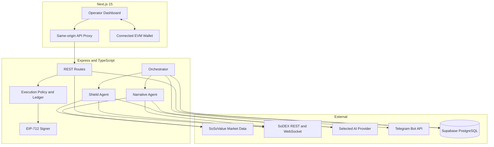

# Gold & Grith

**Market context in. Risk decisions out.**

Gold & Grith is a crypto intelligence and risk terminal built around SoSoValue market data and SoDEX account/market APIs. It runs a narrative scanner and liquidation shield, persists evidence to Supabase, produces optional AI memos, and surfaces operator workflows through a Next.js dashboard and Telegram.

Documentation status: **maintained**. Last full code and upstream SoDEX review: **2026-07-20**.

Detailed status and ownership: [docs/README.md](docs/README.md)

> **SoDEX execution status:** market/account reads, dry-run policy checks, durable execution auditing, and managed registered-API-key signing are implemented. Direct connected-wallet trading is blocked because normal SoDEX trading actions require a registered API key. Mainnet is guarded by `mainnet_canary` and is not live-certified until the production migration, registered-key smoke check, and low-notional operator canary succeed. See [SoDEX compatibility](docs/api-and-eip712-integration-notes.md#implementation-compatibility).

## What it does

Gold & Grith follows an Observe → Reason → Act loop:

| Phase | Behavior | Sources and outputs |
|---|---|---|
| Observe | Fetch news, ETF flow, macro events, SoDEX candles, account state, positions, and order data | SoSoValue and SoDEX APIs |
| Reason | Score eight narratives, classify lifecycle stage, calculate position risk, resolve historical outcomes, and write optional AI memos | Deterministic engines plus the selected AI adapter |
| Act | Persist evidence, notify operators, simulate policy-gated actions, and audit execution attempts | Supabase, dashboard, Telegram, controlled SoDEX testnet/mainnet canary when explicitly enabled |

The two scheduled agents are:

- **Narrative Alpha Scanner** — scores DeFi, AI, RWA, L1, L2, GameFi, DePIN, and Meme using attention velocity, acceleration, source breadth/quality, catalysts, sentiment, and market confirmation.
- **Liquidation Shield** — evaluates liquidation proximity, margin health, volatility, liquidity, funding crowding, macro threat, and flow threat for the monitored SoDEX account.

## Current capabilities

- Narrative lifecycle stages: `EMERGING`, `ACCELERATING`, `ESTABLISHED`, `CROWDED`, `FADING`, and `REVERSING`
- Legacy-compatible signal labels: `STRONG_BUY`, `BUY`, `WATCH`, `NEUTRAL`, and `AVOID`
- Position risk levels: `SAFE`, `CAUTION`, `DANGER`, and `CRITICAL`
- SoDEX markets, order book, candles, deterministic chart analysis, account state, positions, and open orders
- EIP-4361 Sign-In with Ethereum with one-time nonces, wallet-isolated durable identities, and an HttpOnly session cookie
- SoDEX-exclusive Liquidation Shield monitoring with position-level risk, margin pressure, stress scenarios, and rescue estimates
- Non-custodial on-chain automation rules with checker gates, allowlisted adapters, committed calldata, cooldowns, caps, and owner cancellation
- Strategy Marketplace drafts, immutable published versions, wallet-scoped installations, reviews, and separately verified performance evidence
- Dry-run action simulation for close-position, reduce-leverage, cancel-order, and queue-only actions
- Idempotent execution audit rows, cooldown enforcement, notional/leverage/symbol allowlists, and fail-closed production storage
- Signal outcome resolution at 1h, 6h, 24h, and 7d horizons with benchmark alpha and adverse-move evidence
- Operator-scoped performance, alerts, memos, runs, and execution history
- Optional Telegram alerts, commands, and daily summary
- Pluggable Groq, xAI Grok, Gemini, Claude, and SkillMint adapters
- Local-development memory fallback; production persistence failures are explicit

## Architecture



| Layer | Technology |
|---|---|
| Backend | Node.js, TypeScript, `tsx`, Express 4 |
| Frontend | Next.js 15.5, React 18, Tailwind CSS |
| Persistence | Supabase/PostgreSQL |
| Signing | ethers.js and SoDEX EIP-712 `ExchangeAction` payloads |
| AI | Groq, xAI, Gemini, Anthropic, or SkillMint |
| Notifications | Telegram Bot API |
| CI | GitHub Actions on Node.js 22 |

## Repository layout

```text
.
├── backend/
│   ├── agents/                       # Narrative, Shield, and orchestrator loops
│   ├── routes/                       # Express route handlers
│   ├── services/                     # External clients, auth, signing, policy, persistence
│   ├── skills/technical-graph-analysis/
│   ├── tests/
│   ├── app.ts                        # Middleware and route mounts
│   └── server.ts                     # Long-lived server bootstrap
├── frontend/
│   ├── app/                          # App Router pages and same-origin API proxy
│   ├── components/
│   └── lib/
├── docs/                             # Maintained API, protocol, and schema documentation
├── contracts/                        # Solidity automation executor, interfaces, and test adapters
├── scripts/check-docs.mjs            # Documentation consistency checks
├── .env.example                      # Canonical non-secret configuration template
└── package.json                      # Root commands and backend dependencies
```

The npm package names still use the legacy internal identifier `sentinel-finance`; user-facing documentation and UI use **Gold & Grith**.

## Prerequisites

- Node.js **22** (the tested CI baseline)
- npm
- A SoSoValue API key for live intelligence data
- A Supabase project for production
- An EVM wallet with a SoDEX account for wallet-scoped dashboard data
- A dedicated registered SoDEX API key only if enabling managed server-side testnet or mainnet-canary writes
- Credentials for the selected AI provider in production
- A Telegram bot and chat ID only if Telegram is enabled

## Install

```bash
git clone https://github.com/Anu062004/Herewesoso.git
cd Herewesoso
npm ci
npm --prefix frontend ci
cp .env.example .env
```

Edit `.env` locally. Never commit it. For exploratory development, external credentials may be blank, but protected and external-data features will be unavailable or use clearly labeled development fallbacks. Production startup validates mandatory security, persistence, wallet, URL, scheduler, and AI settings.

## Configuration

[`.env.example`](.env.example) is the canonical list of supported configuration keys. Important groups are summarized below.

### Runtime and security

| Variable | Default | Purpose |
|---|---:|---|
| `NODE_ENV` | `development` | Enables production validation and fail-closed behavior when set to `production`. |
| `PORT` | `3001` | Backend listen port. |
| `NEXT_PUBLIC_APP_URL` | `http://localhost:3000` | Frontend origin and Telegram deep-link base. |
| `API_BASE_URL` | `http://localhost:3001` | Server-side frontend proxy target. |
| `NEXT_PUBLIC_API_BASE_URL` | `http://localhost:3001` | Public fallback proxy target. Prefer `API_BASE_URL` for deployments. |
| `ALLOWED_ORIGINS` | local frontend in development | Comma-separated CORS origins; HTTPS is required in production. |
| `SODEX_SESSION_SECRET` | none | Stable secret of at least 32 characters for wallet sessions and action intents. |
| `SODEX_SESSION_TTL_MS` | `86400000` | Session lifetime; allowed range is 5 minutes to 7 days. |
| `CRON_SECRET` | none | Independent 32+ character bearer secret for scheduled routes. |
| `OPERATOR_WALLET_ADDRESSES` | none | Comma-separated wallets allowed to access operational routes. |

### Persistence

| Variable | Purpose |
|---|---|
| `SUPABASE_URL` | Supabase project URL; must use HTTPS in production. |
| `SUPABASE_SERVICE_ROLE_KEY` | Backend-only service-role credential. Never expose it to the browser. |

### Market intelligence and AI

| Variable | Default | Purpose |
|---|---:|---|
| `SOSOVALUE_API_KEY` | none | Sent as `x-soso-api-key`. |
| `SOSOVALUE_BASE_URL` | `https://openapi.sosovalue.com/openapi/v1` | Market-data API base. |
| `AI_SERVICE` | `groq` | `groq`, `grok`/`xai`, `gemini`, `claude`, or `skillmint`. |
| `GROQ_MODEL` | `llama-3.3-70b-versatile` | Groq model name. |
| `XAI_MODEL` | `grok-3` | xAI model name. |
| `GEMINI_MODEL` | `gemini-1.5-flash` | Gemini model name. |
| `ANTHROPIC_MODEL` | `claude-sonnet-4-6` | Anthropic model name. |

Provide the matching credential: `GROQ_API_KEY`, `XAI_API_KEY`, `GEMINI_API_KEY`, `ANTHROPIC_API_KEY`, or `SKILLMINT_AGENT_KEY`. Production requires the selected adapter to be configured. See [SkillMint integration](backend/services/SKILLMINT_INTEGRATION.md) for its additional settings.

### SoDEX and execution

| Variable | Default | Purpose |
|---|---:|---|
| `SODEX_NETWORK` | `testnet` | Default monitored network: `testnet` or `mainnet`. |
| `SODEX_ACCOUNT_ADDRESS` | none | Master account monitored and traded through its registered API key; not an operator-login fallback. |
| `SODEX_ACCOUNT_ID` | discovered | Optional numeric account-ID override for signed automation. |
| `SODEX_API_KEY_NAME` | none | Registered key name sent in `X-API-Key`; it is not an address or secret. |
| `SODEX_API_PRIVATE_KEY` | none | Registered API-key private key for controlled server automation. |
| `SODEX_MANAGED_PRIVATE_KEY` | none | Deployment-managed signing-key override. |
| `SODEX_CHAIN_ID` | `138565` | Must be `138565` for testnet or `286623` for mainnet; mismatches are rejected. |
| `KEY_PROVIDER` | `disabled` | `disabled`, `managed`, `env`, or local-only `local_file`. |
| `EXECUTION_MODE` | `dry_run` | `dry_run`, `testnet`, or guarded `mainnet_canary`. |
| `ALLOWED_SYMBOLS` | `BTC-USD,ETH-USD,SOL-USD` | Execution allowlist. |
| `MAX_LEVERAGE` | `25` | Policy ceiling. |
| `MAX_NOTIONAL_USD` | `10000` | Policy notional ceiling. |
| `ACTION_COOLDOWN_MS` | `60000` | Equivalent-action cooldown. |
| `SHIELD_AUTOMATION_TESTNET_CONTRACT_ADDRESS` | none | Deployed and audited testnet executor address. |
| `SHIELD_AUTOMATION_MAINNET_CONTRACT_ADDRESS` | none | Deployed and audited mainnet executor address. |

The four REST base URLs and the testnet chain ID are in `.env.example`. Mainnet trading uses chain ID `286623`; testnet uses `138565`. Live modes require `KEY_PROVIDER=managed`, Supabase with the production-hardening migration applied, a non-default registered key name, a signer distinct from the master account, and an explicit operator identity that is also distinct from the master account. Keep production at `dry_run` unless the selected signing path has passed the registered-key testnet smoke test.

### Scheduling and validation

| Variable | Default | Purpose |
|---|---:|---|
| `ENABLE_BACKGROUND_SCHEDULER` | `true` outside Vercel | Starts the in-process orchestrator on a long-lived backend. |
| `ENABLE_TELEGRAM_BOT` | `false` | Starts Telegram long polling; enable on exactly one long-lived replica. |
| `CYCLE_INTERVAL_MS` | `1800000` | Agent interval; production minimum is 60 seconds. |
| `DAILY_SUMMARY_UTC_HOUR` | `8` | UTC hour from 0–23. |
| `RISK_ALERT_THRESHOLD` | `65` | Shield alert threshold. |
| `RISK_ALERT_COOLDOWN_MS` | `1800000` | Repeated risk-alert cooldown. |
| `USER_WALLET_ADDRESS` | none | Wallet monitored by the scheduled Shield Agent. |
| `NARRATIVE_MODEL_VERSION` | `narrative-v2.0.0` | Version attached to performance snapshots. |
| `SIGNAL_OUTCOME_NETWORK` | `testnet` | Network used to resolve signal outcomes. |

The remaining outcome-window and optional endpoint-discovery settings are documented inline in `.env.example`.

## Database setup

Apply the migrations from the Supabase SQL editor or your controlled migration runner in this order:

1. [`docs/base-schema.sql`](docs/base-schema.sql)
2. [`docs/narrative-v2-schema.sql`](docs/narrative-v2-schema.sql)
3. [`docs/wave3-schema.sql`](docs/wave3-schema.sql)
4. [`docs/production-hardening-schema.sql`](docs/production-hardening-schema.sql)

The final migration adds durable login challenges, distributed leases/rate limits, execution uniqueness and cooldown indexes, data constraints, RLS, and browser-role revocations. Review and back up an existing database before applying it. The frontend never connects to Supabase directly.

## Run locally

Use separate terminals:

```bash
npm run dev
```

```bash
npm run frontend:dev
```

| Service | URL |
|---|---|
| Frontend | `http://localhost:3000` |
| Backend liveness | `http://localhost:3001/health` |
| Backend API | `http://localhost:3001/api/*` |

The scheduler starts immediately by default on the long-lived backend. Set `ENABLE_BACKGROUND_SCHEDULER=false` when you only want the API. To trigger a cycle manually, use the authenticated operator dashboard or a cron-authorized request:

```bash
curl -X POST \
  -H "Authorization: Bearer $CRON_SECRET" \
  http://localhost:3001/api/trigger
```

## API and authentication

The complete route inventory, authentication matrix, query limits, and action flow are in [docs/api-reference.md](docs/api-reference.md).

Authentication has four levels:

- **Public** — market/news reads and minimal `/health` liveness.
- **Wallet** — any valid signed wallet session.
- **Operator** — wallet session whose address is allowlisted.
- **Operator or cron** — operator session or bearer `CRON_SECRET`.

The domain-bound EIP-4361 signature proves wallet identity and creates an isolated session. It does not sign a trade. Live actions are signed only by the deployment-managed registered SoDEX API key after operator authorization and policy checks.

## Wave 3 implementation evidence

| Capability | Delivered implementation | Operational boundary |
|---|---|---|
| SIWE multi-user | EIP-4361 domain/URI/chain/nonce/expiry messages in `walletAuth`, one-time durable challenges, wallet user/session tables, and owner-scoped APIs | Requires the Wave 3 and production-hardening migrations for durable production sessions |
| SoDEX Liquidation Shield | SoDEX account and position monitoring, liquidation-distance scoring, portfolio stress, rescue estimates, alert evidence, and controlled action preparation | Live protection depends on authenticated SoDEX data and explicitly enabled policy-gated execution |
| On-chain auto execution | `ShieldAutomationExecutor.sol`, checker/adapter interfaces, calldata commitments, permissionless keeper execution, build script, backend transaction preparation, receipt verification, and dashboard rule creation | No contract address is claimed as deployed; deploy and audit adapters/checkers before configuring an address |
| Strategy Marketplace | Owner-authenticated create/publish/install/review APIs, immutable content-hashed versions, performance-claim verification states, Supabase schema, and dashboard catalog | Performance claims remain hidden from public evidence until independently marked `VERIFIED` |

`npm run contracts:compile` produces executor bytecode locally. `npm test` covers SIWE recovery, marketplace immutability/ownership, and automation calldata commitments. These checks prove repository delivery, not a production deployment or profitability.

## Narrative scoring

Narrative v2 is the active opportunity score. Default positive weights are:

| Component | Weight |
|---|---:|
| Attention velocity | 20% |
| Attention acceleration | 15% |
| Source breadth | 15% |
| Source quality | 10% |
| Catalyst strength | 10% |
| Sentiment | 10% |
| Market confirmation | 20% |

Crowding and contradiction are penalties, and the BTC-derived market regime can adjust the result. Calibrated weights may replace defaults after enough resolved observations exist. Confidence is evidence coverage/agreement, not a probability of future return. The stored legacy ETF and macro columns remain useful context but are not direct weighted components of the v2 opportunity score.

Lifecycle stage affects the legacy label: reversing narratives become `AVOID`, fading narratives become `NEUTRAL`, and crowded narratives cannot become `BUY`/`STRONG_BUY`. The exact model is implemented in `backend/services/narrativeEngine.ts` and versioned as `narrative-v2.0.0`.

## Shield risk model

Shield v2 combines:

| Component | Weight |
|---|---:|
| Liquidation proximity | 35% |
| Margin health | 20% |
| Volatility | 15% |
| Liquidity | 10% |
| Funding crowding | 10% |
| Macro threat | 7% |
| Flow threat | 3% |

If SoDEX does not provide a liquidation price, the service estimates one from leverage and labels confidence accordingly. Rescue actions and stress scenarios are estimates only; operators must confirm maintenance margin, fees, liquidity, and price on SoDEX.

## Agent and scheduler behavior

One full cycle:

1. Acquires a durable `orchestrator-cycle` lease.
2. Runs Narrative and Shield concurrently.
3. Fails the cycle if either agent fails.
4. Resolves pending signal outcomes.
5. Records a performance snapshot and final run summary.
6. Releases the lease.

The narrative agent fetches up to 100 headlines, ETF history, macro events, and sector proxy candles. It reasons over up to three qualifying signals per cycle. The shield reads live account state and market evidence for each position, persists snapshots, and alerts only above the configured threshold/cooldown.

The daily summary checker runs every five minutes and sends once during the configured UTC-hour window. Vercel disables in-process scheduling; `backend/vercel.json` instead defines `/api/trigger` every 30 minutes and `/api/daily-summary` at 08:00 UTC.

## SoDEX signing and execution safety

Trading writes use the EIP-712 `ExchangeAction(bytes32 payloadHash,uint64 nonce)` structure. Gold & Grith:

- builds ordered, compact SoDEX payloads with decimal strings;
- hashes `{ type, params }` with Keccak-256;
- uses the `futures` domain for perps;
- allocates live per-signer nonces atomically through Supabase (dry-run development may use process memory);
- prepends the SoDEX typed-signature marker;
- enforces execution mode, network, symbol, leverage, notional, cooldown, and idempotency policy;
- creates a durable audit claim before submission.

For managed automation, the signing private key must derive the public address registered under the non-default `SODEX_API_KEY_NAME`, and it must be distinct from `SODEX_ACCOUNT_ADDRESS`. Every trading write includes that key name in `X-API-Key`; the private key is never sent or logged.

`/api/actions/confirm-wallet` is retained only as an explicit compatibility tombstone and returns `409 CONNECTED_WALLET_EXECUTION_UNSUPPORTED`. The dashboard authorizes through `/api/actions/confirm`; the managed registered key performs the SoDEX EIP-712 signature. Full protocol details and the support matrix are in [docs/api-and-eip712-integration-notes.md](docs/api-and-eip712-integration-notes.md).

## Dashboard routes

| Route | View |
|---|---|
| `/` | Product landing page |
| `/dashboard/sodex/connect` | Wallet challenge login and network selection |
| `/dashboard` | Operator overview |
| `/dashboard/scanner` | Narrative lifecycle and evidence |
| `/dashboard/shield` | Position risk and rescue estimates |
| `/dashboard/strategies` | Strategy Marketplace catalog and publishing |
| `/dashboard/automation` | On-chain automation deployment status and rule creation |
| `/dashboard/positions` | Live account and stored risk history |
| `/dashboard/signals` | Signal feed |
| `/dashboard/performance` | Outcome and model performance |
| `/dashboard/executions` | Execution audit ledger |
| `/dashboard/alerts` | Operator alert feed |
| `/dashboard/memos` | AI memo feed |
| `/dashboard/macro` | Macro calendar |
| `/dashboard/news` | News feed |
| `/dashboard/sodex/markets` | Perps marks and SoSoValue indices |
| `/dashboard/sodex/orderbook` | Order book/depth |
| `/dashboard/sodex/klines` | Candles and technical graph analysis |
| `/dashboard/ai` | On-demand operator analysis |
| `/dashboard/telegram` | Telegram status and test action |

Representative polling intervals are 5 seconds for order book, 10 seconds for Shield positions, 30 seconds for account/alerts/markets/executions/health, 60 seconds for signals/memos/news/performance, and 5 minutes for macro. Polling pauses when the page is hidden and backs off after failures.

## Deployment

The frontend is Vercel-compatible and the backend supports either a long-lived Node process or the serverless handler in `backend/api/index.ts`.

- Set `API_BASE_URL` to an HTTPS backend URL for the frontend proxy.
- Configure the same frontend origin in `ALLOWED_ORIGINS`/`NEXT_PUBLIC_APP_URL`.
- Keep `ENABLE_TELEGRAM_BOT=false` on serverless deployments.
- Run exactly one scheduler and, if enabled, one Telegram long-polling worker across long-lived replicas.
- Do not infer deployment health from a URL stored in the repository. Verify `/health` and an authenticated `/api/health` response during every release.

The code contains `https://35-175-76-98.sslip.io` as a production fallback backend URL for legacy frontend deployments. This documentation audit could not independently verify that deployment, so it is not described as active.

## Validation

```bash
npm run docs:check
npm run contracts:compile
npm run typecheck
npm run lint
npm test
npm --prefix frontend run typecheck
npm run frontend:build
```

Run the project aggregate check with:

```bash
npm run check
```

Backend tests cover environment validation, security boundaries, narrative scoring, risk calculation, outcome resolution, execution policy, SoDEX signing, and technical graph analysis. CI additionally audits production dependencies at high severity.

## Documentation

- [Documentation ownership and migration order](docs/README.md)
- [Gold & Grith API reference](docs/api-reference.md)
- [SoDEX and EIP-712 integration notes](docs/api-and-eip712-integration-notes.md)
- [SkillMint integration](backend/services/SKILLMINT_INTEGRATION.md)
- [Technical graph analysis skill](backend/skills/technical-graph-analysis/SKILL.md)
- [Official SoDEX Trading API](https://sodex.com/documentation/trading-api/trading-api)
- [Official SoDEX Market Data API](https://sodex.com/documentation/market-data-api/market-data-api)

## Security boundaries

- Never commit `.env`, private keys, service-role keys, session secrets, or Telegram tokens.
- Prefer a revocable registered API key over a master-wallet key for server automation.
- Never send signing keys through Telegram or the browser API.
- Keep mainnet execution disabled until an explicit canary review approves the signer, caps, allowlist, monitoring, and rollback plan.
- Treat WebSocket user streams as observable data, not authorization; the current SoDEX docs say they do not require subscription authentication.
- Production writes fail closed when durable auth, storage, rate limiting, policy, or audit claims are unavailable.

## License

This project is private. All rights are reserved unless the repository owner states otherwise.
