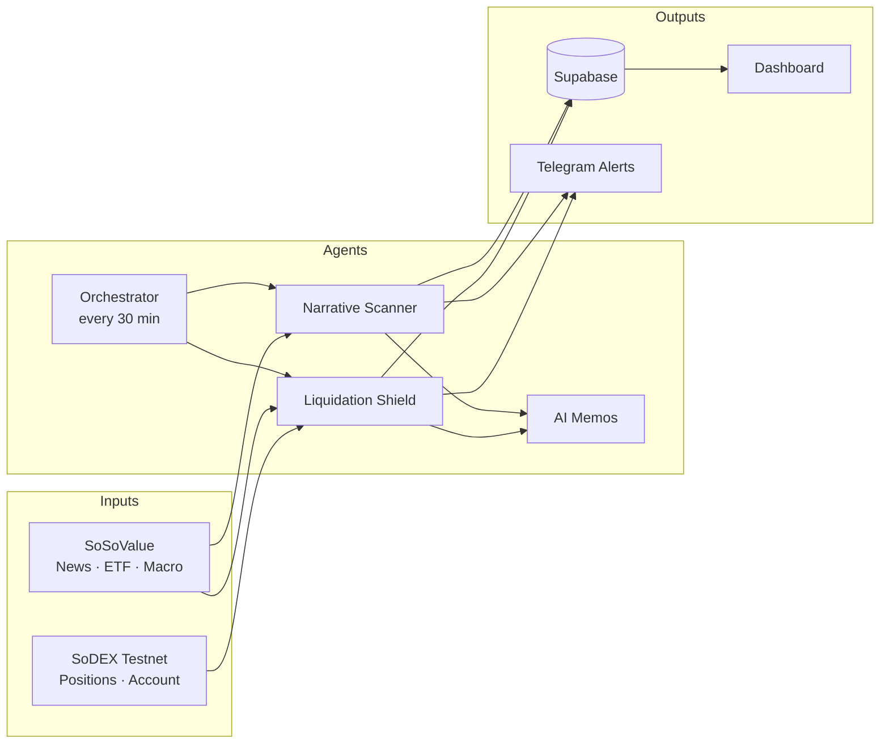
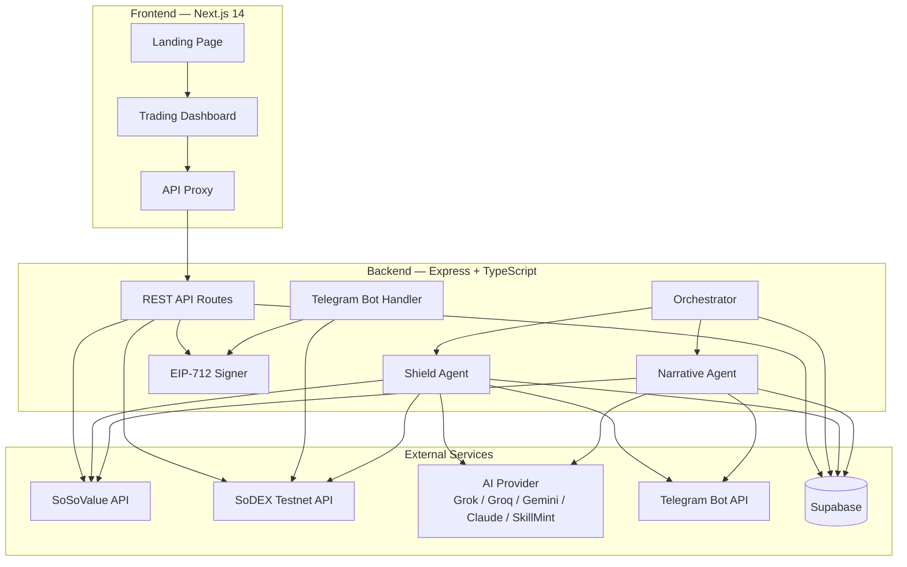

# Gold & Grith

**Market context in. Risk decisions out.**

Gold & Grith is a crypto trading intelligence terminal that connects [SoSoValue](https://sosovalue.com) market data with [SoDEX](https://sodex.com) perps execution on testnet. Two coordinated agents run on a configurable schedule, score crypto sectors, monitor open positions for liquidation risk, generate AI trade memos, and push operator alerts to Telegram and the dashboard.

**Live demo:** [frontend-eight-gilt-90.vercel.app](https://frontend-eight-gilt-90.vercel.app)

**Repository:** [github.com/Anu062004/Herewesoso](https://github.com/Anu062004/Herewesoso)

---

## Table of Contents

- [Product Overview](#product-overview)
- [The Problem](#the-problem)
- [How It Works](#how-it-works)
- [Architecture](#architecture)
- [Key Features](#key-features)
- [Tech Stack](#tech-stack)
- [Project Structure](#project-structure)
- [Prerequisites](#prerequisites)
- [Installation](#installation)
- [Environment Variables](#environment-variables)
- [Database Setup](#database-setup)
- [Running Locally](#running-locally)
- [API Reference](#api-reference)
- [Dashboard](#dashboard)
- [Agent Loops](#agent-loops)
- [AI Providers](#ai-providers)
- [Telegram Bot](#telegram-bot)
- [SoDEX Signing](#sodex-signing)
- [Deployment](#deployment)
- [Testing](#testing)
- [Roadmap](#roadmap)
- [Documentation](#documentation)
- [Security Notes](#security-notes)

---

## Product Overview

Gold & Grith is built for crypto operators who need **narrative alpha discovery** and **position protection** in one terminal-style workspace. The product follows an **Observe → Reason → Act** loop:

| Phase | What happens | Sources |
|-------|--------------|---------|
| **Observe** | Pull news, ETF flows, macro calendar, and live perp positions | SoSoValue API, SoDEX testnet |
| **Reason** | Score sectors, calculate liquidation risk, write AI memos | Narrative Scorer, Risk Calculator, LLM adapters |
| **Act** | Alert operators, surface signals on the dashboard, submit signed trades | Telegram, Supabase, EIP-712 SoDEX writes |

| Agent | Purpose | Primary Data Sources |
|-------|---------|----------------------|
| **Narrative Alpha Scanner** | Scores 8 crypto sectors and surfaces entry signals | SoSoValue news, ETF flow, macro calendar |
| **Liquidation Shield** | Monitors perps positions for liquidation distance and macro-event pressure | SoDEX testnet account/positions, SoSoValue macro data |

Both agents share a common orchestrator, persist results to Supabase, and notify operators via Telegram. The Next.js dashboard provides live polling views, confirmation-gated execution actions, and a trading-terminal UX.

---

## The Problem

Crypto traders juggle fragmented tools: one feed for news and narratives, another for macro calendars, another for positions and liquidation risk. By the time you connect "this sector is heating up" with "my BTC long is 5% from liquidation before CPI," the move has often already happened.

Gold & Grith closes that gap by turning market context into risk decisions on a single operating surface — from SoSoValue intelligence to SoDEX action.

---

## How It Works



1. The **orchestrator** runs both agents on a 30-minute cycle (configurable).
2. The **Narrative Scanner** pulls SoSoValue data, scores sectors, and flags top signals.
3. The **Shield Agent** reads SoDEX positions, calculates risk, and triggers alerts above the threshold.
4. **AI** generates trade memos for signals and risk events.
5. Results are saved to **Supabase** and surfaced on the **dashboard** and **Telegram**.

Default cycle interval: **30 minutes** (`CYCLE_INTERVAL_MS=1800000`).

---

## Architecture



### Component Responsibilities

| Layer | Responsibility |
|-------|----------------|
| **Orchestrator** | Schedules agent cycles, prevents overlap, logs runs, sends daily summaries |
| **Narrative Agent** | Fetches SoSoValue data, scores 8 sectors, generates memos and signal alerts |
| **Shield Agent** | Reads SoDEX positions, computes risk scores, escalates high-risk positions |
| **AI adapters** | Pluggable memo generation behind a single interface (`AI_SERVICE`) |
| **SoDEX signer** | Builds EIP-712 `ExchangeAction` payloads, manages per-address nonces |
| **Supabase** | Persistent store for scores, risks, alerts, memos, and agent run audit log |
| **Dashboard** | Terminal UI with polling, heatmaps, risk gauges, and confirmation-gated actions |
| **API proxy** | Next.js route forwards `/api/*` to the backend in production |

---

## Key Features

### Narrative Alpha Scanner

- Scores **8 sectors**: DeFi, AI, RWA, L1, L2, GameFi, DePIN, Meme
- Combines three scoring layers:
  - **Narrative** — headline relevance and frequency from SoSoValue news
  - **ETF flow** — 7-day net inflow buckets
  - **Macro** — proximity to high-impact events (CPI, FOMC, GDP, NFP, etc.)
- Produces combined scores and signals: `STRONG_BUY`, `BUY`, `WATCH`, `NEUTRAL`, `AVOID`
- Generates AI reasoning memos for top signals

### Liquidation Shield

- Reads SoDEX testnet positions and account state
- Calculates liquidation distance, leverage-adjusted risk, and macro-event threat
- Assigns risk levels: `SAFE`, `CAUTION`, `DANGER`, `CRITICAL`
- Sends alerts when risk exceeds `RISK_ALERT_THRESHOLD` (default: 65)
- Falls back to leverage-based distance estimates when testnet returns `liquidationPrice = 0`

### Operator Terminal

- Terminal-style dashboard with heatmaps, risk gauges, and alert feeds
- SoDEX market data: markets, orderbook, and klines
- Confirmation modals before any execution action
- In-memory fallback when Supabase is unavailable

### Signed SoDEX Actions

- **EIP-712 signed writes** for close position, reduce leverage, and cancel order
- Atomic nonce manager prevents duplicate signature races
- Actions require explicit dashboard confirmation before submission

### Telegram Integration

- Alert delivery for narrative signals and liquidation risk
- Interactive bot commands for status, positions, signals, and trade flows
- `/setkey` flow for registering SoDEX API signing keys
- Daily summary at 08:00 UTC (when scheduler is active)

---

## Tech Stack

| Layer | Technology |
|-------|------------|
| Backend runtime | Node.js, TypeScript, `tsx` |
| API server | Express 4, CORS |
| Frontend | Next.js 14, React 18, Tailwind CSS |
| Database | Supabase (PostgreSQL) |
| AI | Pluggable adapters: xAI Grok, Groq, Gemini, Claude, SkillMint (0G) |
| Blockchain | ethers.js, EIP-712 signing for SoDEX |
| External APIs | SoSoValue OpenAPI, SoDEX testnet REST |
| Notifications | Telegram Bot API |
| Deployment | Vercel (frontend + serverless backend with cron triggers) |

---

## Project Structure

```text
.
├── backend/
│   ├── agents/           # Narrative, Shield, and Orchestrator agents
│   ├── routes/           # Express REST route handlers
│   ├── services/         # SoSoValue, SoDEX, AI, Telegram, Supabase clients
│   ├── utils/            # Narrative scorer, risk calculator
│   ├── tests/            # Unit tests
│   ├── app.ts            # Express app wiring
│   ├── server.ts         # HTTP server + scheduler bootstrap
│   └── vercel.json       # Serverless rewrites and cron jobs
├── frontend/
│   ├── app/              # Next.js App Router pages and API proxy
│   ├── components/       # Dashboard UI, modals, terminal shell
│   └── lib/              # API client, types, polling hooks
├── docs/
│   └── api-and-eip712-integration-notes.md
├── .env.example          # Environment variable template
├── package.json          # Root scripts and backend dependencies
└── README.md
```

---

## Prerequisites

- **Node.js** 18+ (20+ recommended)
- **npm**
- API keys for:
  - [SoSoValue](https://sosovalue.com) (OpenAPI key)
  - At least one AI provider (Grok, Groq, Gemini, or Claude)
  - [Supabase](https://supabase.com) project
  - [Telegram Bot](https://core.telegram.org/bots#botfather) (optional but recommended)
- SoDEX testnet account and API signing key (for live position reads and signed writes)

---

## Installation

```bash
# Clone the repository
git clone https://github.com/Anu062004/Herewesoso.git
cd Herewesoso

# Install backend dependencies
npm install

# Install frontend dependencies
npm --prefix frontend install

# Configure environment
cp .env.example .env
# Edit .env with your API keys (see below)
```

---

## Environment Variables

Copy `.env.example` to `.env` and configure the following groups.

### AI Service (pick one)

| Variable | Description |
|----------|-------------|
| `AI_SERVICE` | `grok` (recommended), `groq`, `gemini`, `claude`, or `skillmint` |
| `XAI_API_KEY` | xAI Grok API key |
| `XAI_MODEL` | Default: `grok-3` |
| `GROQ_API_KEY` | Groq API key |
| `GROQ_MODEL` | Default: `llama-3.3-70b-versatile` |
| `GEMINI_API_KEY` | Google Gemini API key |
| `ANTHROPIC_API_KEY` | Anthropic Claude API key |
| `SKILLMINT_*` | SkillMint / 0G verifiable execution settings (see `.env.example`) |

All AI adapters expose the same interface — switching providers requires only changing `AI_SERVICE`.

### SoSoValue

| Variable | Description |
|----------|-------------|
| `SOSOVALUE_API_KEY` | API key sent as `x-soso-api-key` |
| `SOSOVALUE_BASE_URL` | Default: `https://openapi.sosovalue.com/openapi/v1` |

### SoDEX Testnet

| Variable | Description |
|----------|-------------|
| `SODEX_TESTNET_PERPS` | Perps REST base URL |
| `SODEX_ACCOUNT_ADDRESS` | Master or account wallet address |
| `SODEX_API_KEY_NAME` | Registered API key name |
| `SODEX_API_PRIVATE_KEY` | API key private key for EIP-712 signing |
| `SODEX_CHAIN_ID` | Default: `138565` |

### Supabase

| Variable | Description |
|----------|-------------|
| `SUPABASE_URL` | Project URL |
| `SUPABASE_SERVICE_ROLE_KEY` | Service role key (backend writes) |
| `NEXT_PUBLIC_SUPABASE_URL` | Same URL for frontend |
| `NEXT_PUBLIC_SUPABASE_ANON_KEY` | Anon key for frontend reads |

### Telegram

| Variable | Description |
|----------|-------------|
| `TELEGRAM_BOT_TOKEN` | Bot token from BotFather |
| `TELEGRAM_CHAT_ID` | Target chat ID for alerts |

### App Configuration

| Variable | Default | Description |
|----------|---------|-------------|
| `PORT` | `3001` | Backend port |
| `CYCLE_INTERVAL_MS` | `1800000` | Agent cycle interval (30 min) |
| `RISK_ALERT_THRESHOLD` | `65` | Shield alert trigger score |
| `USER_WALLET_ADDRESS` | — | Wallet monitored by Shield Agent |
| `NEXT_PUBLIC_APP_URL` | `http://localhost:3000` | Frontend URL for Telegram deep links |
| `NEXT_PUBLIC_API_BASE_URL` | `http://localhost:3001` | Backend URL for frontend |
| `AUTO_EXECUTE` | `false` | Disable automatic trade execution |

---

## Database Setup

Create the following tables in your Supabase project.

```sql
-- Narrative sector scores from each scanner cycle
CREATE TABLE narrative_scores (
  id UUID PRIMARY KEY DEFAULT gen_random_uuid(),
  created_at TIMESTAMPTZ DEFAULT now(),
  sector TEXT NOT NULL,
  score_narrative INTEGER NOT NULL,
  score_etf_flow INTEGER NOT NULL,
  score_macro INTEGER NOT NULL,
  combined_score INTEGER NOT NULL,
  signal TEXT NOT NULL,
  top_headlines JSONB DEFAULT '[]',
  reasoning TEXT
);

-- Position risk snapshots from each shield cycle
CREATE TABLE position_risks (
  id UUID PRIMARY KEY DEFAULT gen_random_uuid(),
  created_at TIMESTAMPTZ DEFAULT now(),
  wallet_address TEXT NOT NULL,
  symbol TEXT NOT NULL,
  entry_price NUMERIC NOT NULL,
  mark_price NUMERIC NOT NULL,
  liquidation_price NUMERIC NOT NULL,
  leverage NUMERIC NOT NULL,
  position_size NUMERIC NOT NULL,
  distance_to_liquidation_pct NUMERIC NOT NULL,
  risk_score INTEGER NOT NULL,
  risk_level TEXT NOT NULL,
  macro_threats JSONB
);

-- Operator alerts (narrative signals, liquidation risk, macro events)
CREATE TABLE alerts (
  id UUID PRIMARY KEY DEFAULT gen_random_uuid(),
  created_at TIMESTAMPTZ DEFAULT now(),
  alert_type TEXT NOT NULL,
  severity TEXT NOT NULL,
  title TEXT NOT NULL,
  message TEXT NOT NULL,
  telegram_sent BOOLEAN DEFAULT false,
  data JSONB
);

-- AI-generated trade memos
CREATE TABLE trade_memos (
  id UUID PRIMARY KEY DEFAULT gen_random_uuid(),
  created_at TIMESTAMPTZ DEFAULT now(),
  memo_type TEXT NOT NULL,
  content TEXT NOT NULL,
  related_symbol TEXT,
  data JSONB
);

-- Agent run audit log
CREATE TABLE agent_runs (
  id UUID PRIMARY KEY DEFAULT gen_random_uuid(),
  created_at TIMESTAMPTZ DEFAULT now(),
  updated_at TIMESTAMPTZ DEFAULT now(),
  agent TEXT NOT NULL,
  status TEXT NOT NULL DEFAULT 'running',
  duration_ms INTEGER,
  error TEXT,
  summary JSONB
);

CREATE INDEX idx_narrative_scores_created ON narrative_scores (created_at DESC);
CREATE INDEX idx_position_risks_created ON position_risks (created_at DESC);
CREATE INDEX idx_alerts_created ON alerts (created_at DESC);
CREATE INDEX idx_trade_memos_created ON trade_memos (created_at DESC);
CREATE INDEX idx_agent_runs_created ON agent_runs (created_at DESC);
```

Supabase writes are wrapped in safe helpers — if the database is unavailable, agents log warnings and continue using in-memory fallbacks.

---

## Running Locally

```bash
# Terminal 1 — Backend (with scheduler + Telegram bot)
npm run dev

# Terminal 2 — Frontend
npm run frontend:dev
```

| Service | URL |
|---------|-----|
| Frontend | http://localhost:3000 |
| Backend API | http://localhost:3001 |
| Health check | http://localhost:3001/health |

### Additional Scripts

```bash
npm run typecheck       # TypeScript check (backend)
npm test                # Run backend unit tests
npm run frontend:build  # Production frontend build
npm run frontend:start  # Start production frontend
```

### Manual Cycle Trigger

```bash
curl -X POST http://localhost:3001/api/trigger
```

---

## API Reference

### Health and Agents

| Method | Endpoint | Description |
|--------|----------|-------------|
| `GET` | `/health`, `/api/health` | Service health and Telegram status |
| `GET` | `/api/agent-runs` | Latest orchestrator run metadata |
| `POST` | `/api/trigger` | Manually run a full agent cycle |
| `POST` | `/api/daily-summary` | Force-send daily Telegram summary |

### Intelligence Data

| Method | Endpoint | Description |
|--------|----------|-------------|
| `GET` | `/api/signals` | Latest narrative sector scores |
| `GET` | `/api/positions` | Live SoDEX positions + risk history |
| `GET` | `/api/alerts` | Alert feed |
| `GET` | `/api/memos` | AI trade memos |
| `GET` | `/api/macro` | Upcoming macro events |
| `GET` | `/api/risks` | Position risk snapshots |
| `GET` | `/api/news` | SoSoValue news feed |
| `POST` | `/api/analyze` | On-demand narrative analysis |

### SoDEX Market Data

| Method | Endpoint | Description |
|--------|----------|-------------|
| `GET` | `/api/sodex/account` | Account state and balances |
| `GET` | `/api/sodex/markets` | Perps market list |
| `GET` | `/api/sodex/orderbook/:symbol` | Order book for a symbol |
| `GET` | `/api/sodex/klines/:symbol` | Candlestick data |
| `GET` | `/api/sodex/open-orders` | Open orders for the account |

### Actions and Notifications

| Method | Endpoint | Description |
|--------|----------|-------------|
| `POST` | `/api/actions` | Close position, reduce leverage, cancel order |
| `POST` | `/api/test-telegram` | Send a test Telegram message |

**Action payload examples:**

```json
{ "action": "CLOSE_POSITION", "symbol": "BTC-USD" }
```

```json
{ "action": "REDUCE_LEVERAGE", "symbol": "BTC-USD", "currentLeverage": 20, "targetLeverage": 10 }
```

```json
{ "action": "CANCEL_ORDER", "orderId": "12345" }
```

Supported actions: `CLOSE_POSITION`, `REDUCE_LEVERAGE`, `CANCEL_ORDER`, `QUEUE_ACTION`.

---

## Dashboard

The trading terminal is available at `/dashboard` with the following views:

| Route | Description |
|-------|-------------|
| `/` | Landing page with system map and product overview |
| `/dashboard` | Overview with health, agent runs, and quick actions |
| `/dashboard/scanner` | Narrative Alpha Scanner heatmap |
| `/dashboard/shield` | Liquidation Shield risk monitor |
| `/dashboard/positions` | Live positions and risk history |
| `/dashboard/signals` | Sector signal feed |
| `/dashboard/alerts` | Alert stream with severity filters |
| `/dashboard/memos` | AI-generated trade memos |
| `/dashboard/macro` | Macro event calendar |
| `/dashboard/news` | SoSoValue news feed |
| `/dashboard/sodex/markets` | SoDEX market overview |
| `/dashboard/sodex/orderbook` | Live order book |
| `/dashboard/sodex/klines` | Price charts |
| `/dashboard/ai` | On-demand AI analysis |
| `/dashboard/telegram` | Bot setup and test panel |

### Polling Intervals

| Resource | Interval |
|----------|----------|
| Positions | 30 seconds |
| Signals | 60 seconds |
| Alerts | 30 seconds |
| Health / agent runs | 30 seconds |

Execution buttons open a confirmation modal before submitting signed SoDEX actions.

---

## Agent Loops

### Narrative Alpha Scanner

1. Fetch news (50 headlines), 7-day ETF summary, and macro events from SoSoValue.
2. For each of 8 sectors, compute narrative, ETF, and macro layer scores.
3. Combine layers into a weighted signal with `generateSignal()`.
4. Generate AI reasoning for strong signals.
5. Persist scores to `narrative_scores`, memos to `trade_memos`, and alerts to `alerts`.
6. Send Telegram notification for the top signal.

### Liquidation Shield

1. Fetch SoDEX testnet positions and account state (falls back to demo BTC-USD position on failure).
2. Pull macro events and ETF flow context from SoSoValue.
3. For each position, calculate liquidation distance, position risk, and macro threat.
4. Combine into a risk score and level (`SAFE` → `CRITICAL`).
5. Persist snapshots to `position_risks`.
6. Send Telegram alert when risk score exceeds threshold.

### Orchestrator

- Runs both agents sequentially on `CYCLE_INTERVAL_MS`.
- Prevents overlapping cycles with an in-flight lock.
- Logs each run to `agent_runs`.
- Sends a daily AI summary to Telegram at 08:00 UTC.

---

## AI Providers

Set `AI_SERVICE` to switch providers without code changes:

| Provider | `AI_SERVICE` value | Best for |
|----------|-------------------|----------|
| xAI Grok | `grok` or `xai` | Highest reasoning quality (recommended) |
| Groq | `groq` | Fast inference, free tier |
| Google Gemini | `gemini` | Alternative cloud LLM |
| Anthropic Claude | `claude` | Default fallback |
| SkillMint (0G) | `skillmint` | Verifiable, TEE-attested memos with on-chain receipts |

See `backend/services/SKILLMINT_INTEGRATION.md` for SkillMint setup details.

---

## Telegram Bot

When the backend scheduler is active, the Telegram bot provides:

- **Alerts** — narrative signals and liquidation warnings with dashboard deep links
- **Commands** — status, positions, signals, news, macro, and trade flows
- **Key management** — `/setkey` to register SoDEX API signing credentials
- **Daily summary** — AI-generated recap of the previous 24 hours

The bot runs alongside the scheduler in local development. On Vercel, cron jobs trigger cycles via `/api/trigger`.

---

## SoDEX Signing

SoDEX trading writes are not ordinary REST calls. Each action requires an EIP-712 `ExchangeAction` signature:

1. Build the action payload (order, leverage update, cancel, etc.).
2. Hash the payload and construct the typed data domain (`spot` or `futures`, chain ID, verifying contract).
3. Sign with the registered API key private key.
4. Attach the signature and nonce headers to the request.

Gold & Grith implements this in `backend/services/sodexSigner.ts` with an atomic nonce manager in `sodexNonceManager.ts`. Full implementation notes are in [docs/api-and-eip712-integration-notes.md](docs/api-and-eip712-integration-notes.md).

---

## Deployment

### Frontend (Vercel)

The frontend deploys to Vercel as a Next.js app. Set `NEXT_PUBLIC_API_BASE_URL` to your backend URL. The API proxy at `frontend/app/api/proxy/[...path]/route.ts` forwards dashboard requests to the backend.

### Backend (Vercel Serverless)

The backend includes `backend/vercel.json` with:

- Rewrite all routes to the serverless handler
- Cron: `/api/trigger` every 30 minutes
- Cron: `/api/daily-summary` at 02:30 UTC

On Vercel, the in-process scheduler is disabled (`VERCEL=1`). Agent cycles are driven by cron instead.

Set all environment variables from `.env.example` in your Vercel project settings.

---

## Testing

```bash
npm test
```

Unit tests cover:

- `narrativeScorer` — sector scoring and signal generation
- `riskCalculator` — liquidation distance and risk level mapping
- `sodexSigner` — EIP-712 payload signing

---

## Roadmap

### Implemented

- Dual-agent orchestration with configurable cycle interval
- SoSoValue integration (news, ETF, macro)
- SoDEX testnet reads and EIP-712 signed writes (close, reduce leverage, cancel order)
- Pluggable AI memo generation
- Supabase persistence with graceful degradation
- Telegram alerts and interactive bot
- Full trading terminal dashboard
- Confirmation-gated execution flow

### Planned

- Mainnet SoDEX integration with production key management
- Verifiable AI memos via SkillMint with on-chain receipts
- Automated execution policies (`AUTO_EXECUTE`) with human-in-the-loop confirmation
- WebSocket streaming for real-time market data
- Richer narrative scoring (on-chain flows, social velocity, sector correlation)
- Portfolio-wide shield across multiple wallets

---

## Documentation

- [API and EIP-712 Integration Notes](docs/api-and-eip712-integration-notes.md) — SoDEX signing, nonce rules, and endpoint reference
- [SkillMint Integration](backend/services/SKILLMINT_INTEGRATION.md) — Verifiable AI execution on 0G
- [SoSoValue API Docs](https://sosovalue-1.gitbook.io/sosovalue-api-doc)
- [SoDEX Trading API](https://sodex.com/documentation/trading-api/trading-api)

---

## Security Notes

- Never commit `.env` or private keys. The repository `.gitignore` excludes them.
- Use Supabase Row Level Security in production.
- SoDEX API keys are revocable signing credentials — treat `SODEX_API_PRIVATE_KEY` as a secret.
- Dashboard actions require explicit confirmation before signed writes.
- Telegram bot signing keys can also be set at runtime via `/setkey` (stored locally in `.sodex_key`).

---

## License

This project is private. All rights reserved unless otherwise specified by the repository owner.
